# Elastic mixer parallelism: the first experiments

*Stage 1 of the architecture-aware parallelism work in this repository. All measurements were taken on
2026-10-01 and 2026-10-02 on guppy (4x RTX A6000 48 GB, PCIe Gen4, no NVLink, a shared box). Every number
below comes from the committed `results/` tree; `python blog/make_figs.py` rebuilds the figures in
`blog/figs/` from those files. The long-form plan, execution log and findings live in
[`doc/stage1_elastic_mixer_parallelism_plan.md`](../doc/stage1_elastic_mixer_parallelism_plan.md).*

## TL;DR

- Falcon-H1 is a *parallel* hybrid: every decoder layer runs an attention mixer and a Mamba-2 mixer on the
  same input and sums them. A **branch split** of the 4-GPU tensor-parallel group (2 attention ranks + 2
  Mamba ranks, one all-reduce of the scaled partial sums; `split22`) beats vLLM's tensor parallelism
  (`tp4`) in **every cell** of a 4 batch x 4 context sweep on the 7B: 1.07x to 1.38x per decoder layer,
  CUDA-graph step. The 3B repeats it (1.00x to 1.43x).
- Two effects add up, separated by two extra baselines: vLLM pays **four** four-rank all-reduces per
  Falcon-H1 layer and fusing them to three is worth 1.03x to 1.13x on its own; the rest comes from each
  rank running **one** branch plus its MLP slice instead of both branches, which also removes the
  replicated KV-head reads (7B: 2 KV heads on 4 ranks, so TP reads every KV byte twice per step).
- The elastic piece of the original idea, **"swing" MLP shards moved per step to the ranks with slack,
  does not work in a synchronous layer**. Every all-reduce is a barrier, so the step is a sum of per-phase
  maxima; MLP columns moved across the barrier only raise the MLP maximum. Balancing has to move work
  *inside* the mixer phase. This is the main negative result and it reshapes the next stage.
- The three measured effects became a **recipe** (`harness/synth.py`) that derives candidate rank-group
  layouts from a model's config and scores them with a byte model. Its pre-registered predictions had the
  right sign in all 32 cells of the 7B and 34B sweeps, the 3B sweep has the predicted shape, and the two
  negative predictions held: Falcon-H1-34B (4 KV heads, replication-free under tp4) flips to a loss at
  long context (0.68x at batch 64, 32K tokens), and Falcon-40B (parallel attention/MLP, 8 KV heads) has
  no winning split at 4 ranks (0.66x to 0.97x), so the recipe recommends tp4 there.

## 1. The architecture and the waste in plain tensor parallelism

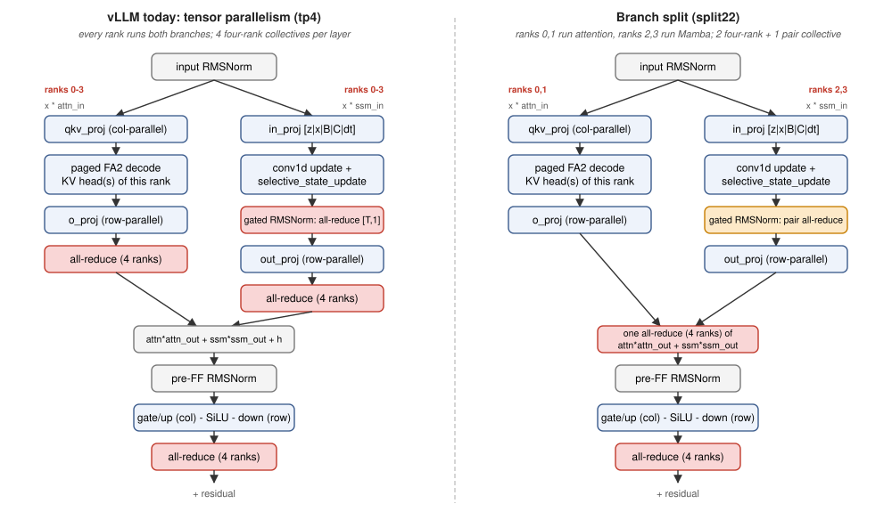

A Falcon-H1 layer computes `h + attn_out * Attn(norm(h) * attn_in) + ssm_out * Mamba(norm(h) * ssm_in)`,
then a gated MLP. vLLM's implementation (`falcon_h1.py` + `MambaMixer2`) shards both branches and the MLP
over the TP group and reduces four times per layer: after `o_proj`, inside the Mamba gated RMSNorm (a
`[T, 1]` sum of squares, because the norm groups are split across ranks), after `out_proj` and after the
MLP `down_proj`. The two branch partials are summed into the residual anyway, so one all-reduce of
`attn * attn_out + ssm * ssm_out` is enough (`tp4_fused`).

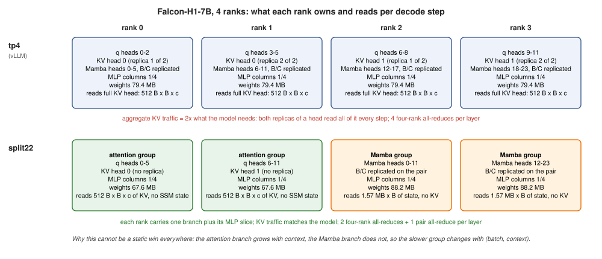

The deeper waste is replication. The 7B has 12 query heads but only 2 KV heads, so at TP 4 each KV head
lives on two ranks and **both replicas read the whole head every decode step**: aggregate KV traffic is
twice what the model needs, and it grows with context. Under `split22` ranks 0 and 1 each own one KV head
and six query heads, ranks 2 and 3 each own 12 of the 24 Mamba heads, and the MLP stays evenly sharded on
all four. Each rank's branch output is a row-parallel partial scaled by its multiplier; one four-rank
all-reduce sums everything; the Mamba gated norm reduces over a two-rank pair group.

The catch is that the attention branch grows with context while the Mamba branch does not (its state is
`B x heads x 128 x 256`, independent of context), so no static split is balanced for long. The original
hypothesis (H3) was to absorb the imbalance with **swing MLP shards**: every rank holds its base MLP slice
plus a replicated swing slice, and per step the swing columns are assigned to the ranks with slack. No data
moves, because the MLP input is replicated after the mixer all-reduce and `down_proj` partials are summed
by the MLP all-reduce whoever computed them.

Pre-registered expectation from the byte model (per-rank bytes per layer per step): tie at short
context, 1.2x to 1.4x at medium context and moderate batch, a fade at 32K tokens where attention alone
dominates, and the 34B (4 KV heads) should tie at 4 ranks and win only at 8.

## 2. How we measure

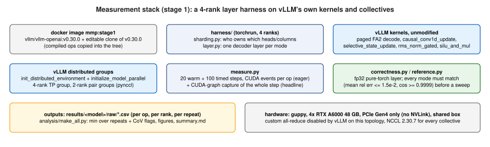

- **Unit**: one decoder layer (layer 0, real bf16 weights from the HF safetensors), one decode step for
  `B` sequences each at context `c`, on 4 ranks under `torchrun`. Per-layer numbers multiply by the layer
  count (44 for the 7B); embeddings and `lm_head` are identical across modes and excluded.
- **Kernels and groups are vLLM's own** (v0.30.0, editable clone inside the `vllm/vllm-openai:v0.30.0`
  image): paged FlashAttention-2 decode, `causal_conv1d_update`, `selective_state_update`,
  `rms_norm_gated`, `silu_and_mul`; process groups from `initialize_model_parallel` plus pair sub-groups.
  vLLM disables its custom all-reduce on this PCIe topology, so every collective is NCCL 2.30.7 through
  pynccl, for every mode alike.
- **Modes** and collectives per layer:

  | mode | attention | Mamba | collectives per layer |
  |---|---|---|---|
  | `tp4` (vLLM-faithful) | 3 q heads + replicated KV head per rank | 6 heads per rank, B/C replicated | 4 four-rank |
  | `tp4_fused` | same | same | 3 four-rank (one mixer reduction) |
  | `tp4_streams` | same | same | 3 four-rank; the two branches on two CUDA streams per rank (a baseline TII never ran) |
  | `split22` | ranks 0,1: 6 q heads + 1 KV head | ranks 2,3: 12 heads | 2 four-rank + 1 pair |
  | `split22_swing{S}` | as split22 | as split22 | as split22; swing fraction S of the MLP, cuts chosen per step |

- **Sweep**: `B` in {1, 4, 16, 64}, `c` in {512, 2048, 8192, 32768}, KV block 16, 20 warm-up and 100
  timed steps, 3 repeats interleaved across modes. The eager variant records a CUDA event per op per rank
  (the breakdowns); a **CUDA-graph capture of the whole step, collectives included**, gives the headline
  numbers, because eager is launch-bound (1.9 ms vs 0.31 ms at batch 4, context 2048).
- **Reported number**: `step_max` = max over ranks of the median step time; the **minimum over repeats**,
  because foreign GPU load on the shared box inflates some repeats; cells whose repeats disagree by more
  than 5% (CoV) are flagged `*`.
- **Correctness gate before every sweep**: each mode against an fp32 pure-torch layer. 7B: mean relative
  error 0.7 to 0.9% for every mode, cosine 0.99997, bitwise-identical outputs across ranks. 34B: 0.7 to
  1.0%. Falcon-40B template: 0.17%. The gate caught two real bugs: vLLM's Mamba kernels treat state line 0
  as the null block, and the gated norm must normalise per `n_group` (the 34B `tp1` path was 53% off until
  fixed).

## 3. Result 1: Falcon-H1-7B

Batch 16, graph step, layer time and speedup over `tp4`:

| context | tp4 | tp4_fused | tp4_streams | split22 |
|---|---|---|---|---|
| 512 | 0.366 ms | 1.09x | 1.16x | 1.11x |
| 2048 | 0.388 ms | 1.09x | 1.17x | 1.18x |
| 8192 | 0.469 ms | 1.07x | 1.17x | **1.38x** |
| 32768 | 0.790 ms | 1.04x | 1.12x | 1.19x |

Over the full 16-cell sweep `split22` is 1.07x to 1.38x, `tp4_fused` 1.03x to 1.13x and `tp4_streams`
1.06x to 1.21x (full table in [`results/full/summary/summary.md`](../results/full/summary/summary.md)).

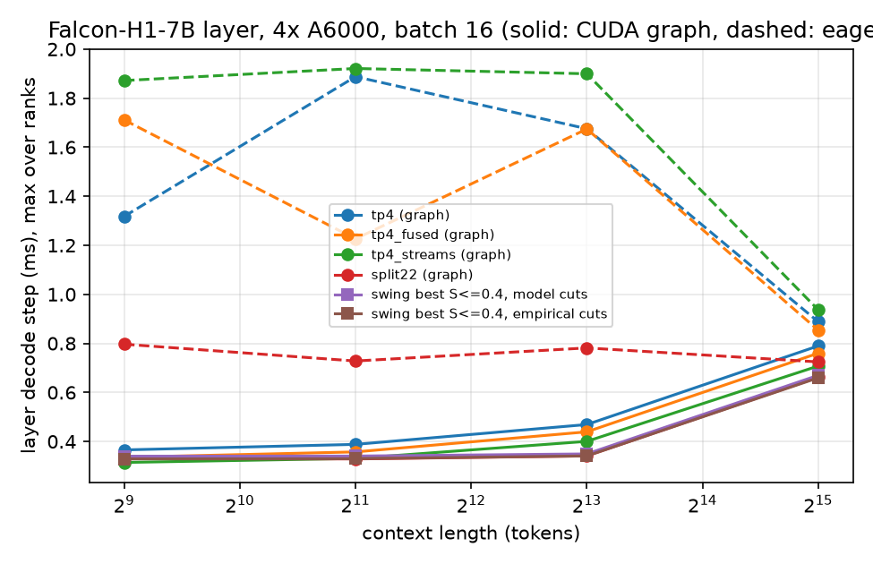

Where the time goes per rank (eager breakdown; the collective bars include the cross-rank wait, which is
the imbalance made visible):

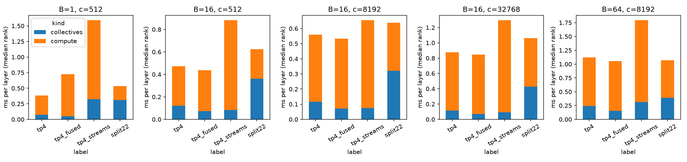

The diagnostic that explains the shape: run every rank's compute with the collectives removed
(`--no-collectives`), so each rank's time is its own work only.

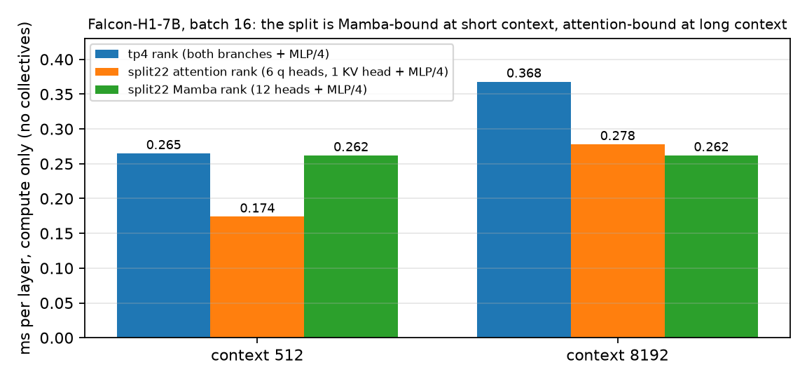

A `tp4` rank does both branches plus a quarter of the MLP; a `split22` rank does one branch plus a quarter
of the MLP. The split is Mamba-bound at 512 tokens (the attention ranks finish a third earlier than the
Mamba ranks) and attention-bound at 8K, exactly as the byte model says, and it wins because the slower of the two halves is
still cheaper than the sum, on top of one fewer four-rank collective. At 32K tokens and batch 64 the
attention branch alone exceeds everything else and the gain fades to 1.12x, which is the predicted fade.

## 4. Result 2: swing MLP shards do not work, and why

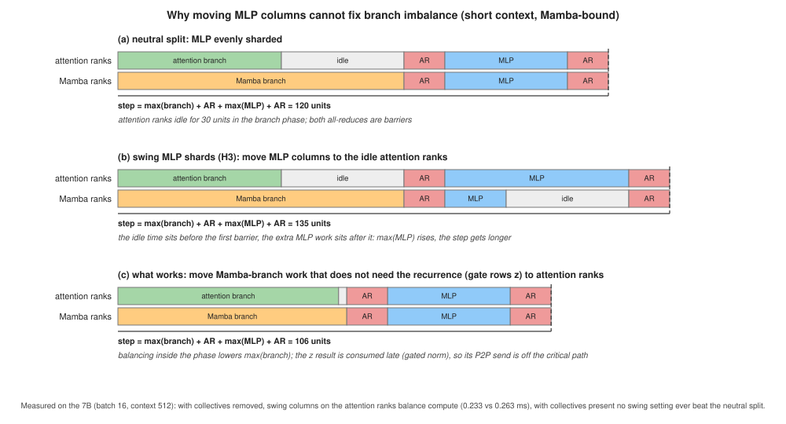

Two implementations were measured: swing columns as a second GEMM chain per rank (costs extra small-GEMM
launches) and a contiguous pool with one split point per pair (overhead-free). Neither ever beat the plain
split: in all 16 cells of the full sweep the best swing setting is within 0.01x of `split22`, and the
winning "cuts" are usually the neutral ones (table in `results/full/summary`). With the collectives
removed, moving the swing columns to the attention ranks *does* balance compute (0.233 ms vs 0.263 ms at
batch 16, context 512), so the mechanism works and the barrier is the problem: the idle time sits before
the mixer all-reduce and the extra MLP work sits after it. H3 is rejected for single-micro-batch
execution; it could only pay with two interleaved micro-batches.

What balancing must look like instead: move work **within** the mixer phase, choosing the split point per
step from the same slack measurement and migrating no state.

- Short context (Mamba-bound): the attention ranks compute the Mamba gate projection `z` (1536 of the
  3596 `in_proj` rows per Mamba rank, 9.4 MB of weights) and send it point-to-point to their partner;
  `z` is consumed only at the gated norm, late in the branch, so the send is off the critical path. This
  is the earlier SSM/gate split reborn as a per-step balancing move.
- Long context (attention-bound): the Mamba ranks hold the second half of their partner's KV positions
  and compute a partial attention, merged by the partner with the log-sum-exp trick (a decode-context-
  parallel merge inside a pair).

## 5. The recipe

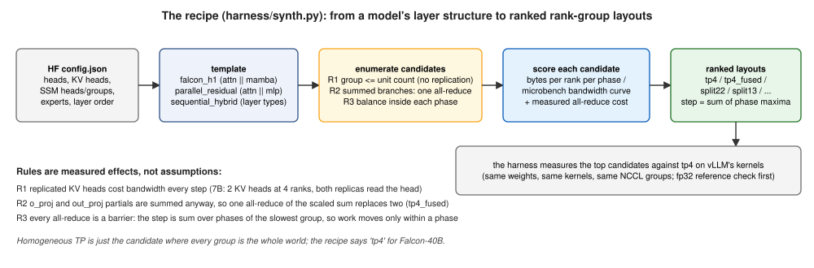

`harness/synth.py` turns a model's layer structure into ranked rank-group layouts with three rules, each
one a measured effect of the 7B sweep: **R1** an operator's rank group never exceeds its unit count (KV
heads, SSM heads or groups, experts), because replicas re-read the data every step; **R2** operators that
read the same input and are summed into the residual can live on disjoint groups with one all-reduce of
partial sums; **R3** every all-reduce is a barrier, so the step is the sum over phases of the slowest
group's time, and groups are sized to balance inside a phase. The scorer uses the microbench bandwidth
curves (achieved bandwidth vs bytes for GEMV, attention decode, SSM update, conv update, all-reduce per
group size), which is where the small-batch occupancy effects come from. Homogeneous tensor parallelism is
the candidate where every group is the whole world. Predictions were written down before each run
(doc section 23):

| model | layout | B1 c512 | B16 c512 | B16 c8K | B64 c8K | B64 c32K |
|---|---|---|---|---|---|---|
| Falcon-H1-7B | attention 2 + Mamba 2 | 1.35x | 1.29x | 1.44x | 1.31x | 1.12x |
| Falcon-H1-3B | attention 2 + Mamba 2 | 1.39x | 1.25x | 1.47x | 1.37x | 1.14x |
| Falcon-H1-34B | attention 2 + Mamba 2 | 1.18x | 1.12x | 1.09x | 0.91x | 0.66x |
| Falcon-H1-34B, 8 ranks | attention 4 + Mamba 4 | 1.20x | 1.23x | 1.37x | 1.29x | 1.11x |
| Falcon-40B | attention 1 + MLP 3 | 1.08x | 1.08x | 0.85x | 0.54x | 0.34x |
| Falcon-40B | attention 2 + MLP 2 | 0.73x | 0.74x | 0.81x | 1.02x | 0.68x |

## 6. Result 3: three more models

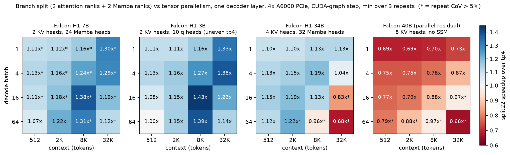

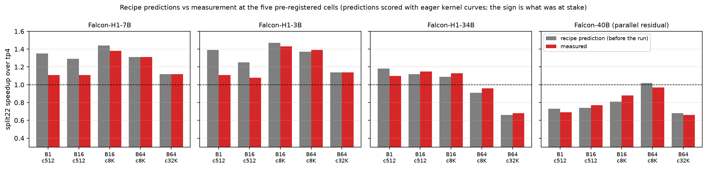

- **Falcon-H1-3B** (10 query heads, 2 KV heads). Homogeneous TP 4 is not even definable, since 10 heads
  do not divide by 4; vLLM caps the 3B at TP 2. The split is feasible (5 query heads per attention rank,
  16 Mamba heads per Mamba rank). We implemented uneven 3/2/3/2 query-head shards to have a `tp4` baseline
  at all: `split22` is 1.00x to 1.43x over it with repeat CoV below 2% in every cell, and 1.23x to 1.57x
  over TP 2, the largest layout an engine could ship today.

  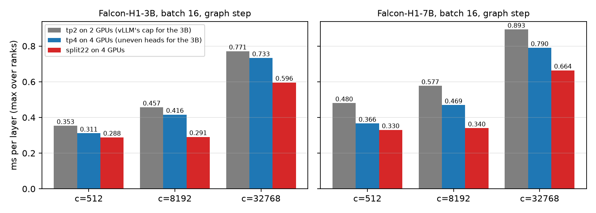

- **Falcon-H1-34B** (4 KV heads). `tp4` is replication-free here, so the split only saves collectives and
  occupancy: 1.10x to 1.22x at 512 to 2048 tokens, then a sign flip at long context (0.83x at batch 16 and
  32K, 0.68x at batch 64 and 32K) because each attention rank now reads two KV heads, twice a `tp4` rank's
  KV, while the Mamba ranks idle. The recipe's graph-curve re-score predicted 1.00x at short context and
  0.62x at batch 64 and 32K; the sign flip was predicted. The long-context column carries high-CoV flags
  (foreign load during the run; the minimum over repeats is reported). At 8 ranks (attention 4 + Mamba 4)
  the recipe predicts 1.11x to 1.37x everywhere; the 8-rank code paths exist and wait for an H200 node.
- **Falcon-40B** (parallel-residual Transformer: attention and MLP summed, 8 KV heads). No winning split
  at 4 ranks: `split22` 0.66x to 0.97x, `split13` 0.32x to 1.03x, stream overlap 1.00x to 1.08x. The
  recipe said so beforehand (`split22` 0.65x to 0.99x) because `tp4` is already replication-free and the
  unbounded MLP dominates; its recommendation is `tp4` with the fused reduction and stream overlap. The
  recipe discriminates between architectures rather than always splitting.
- **Sequential hybrids** (Nemotron 3 Nano, Qwen3.5-35B-A3B; Mamba, attention and MoE as separate layers).
  The same rules emit data-parallel attention beside tensor-parallel Mamba and expert-parallel MoE, the
  configuration engines reached by hand. Predicted per attention layer: data parallel beats tensor
  parallel only at long context and high batch (Nemotron 1.34x at batch 64 and 8K, 1.75x at 32K) and
  loses at short context (0.47x to 0.87x); weighted by layer counts the composite gain is at most 1.11x
  (Nemotron) and 1.28x (Qwen3.5) at long context and nothing at short, so the paradigm there is an
  elastic per-step choice of the attention layout, not a static split. The Nemotron 3 Nano timing sweep
  has run (60 configurations); its composite analysis is not committed yet.

## 7. Byte-model accuracy (known limitation)

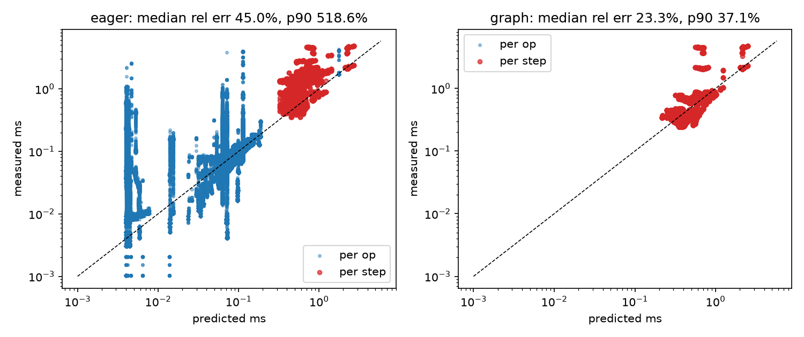

Per-step predictions for the graph variant have a median relative error of 23% (p90 37%); the eager
variant is launch-bound and far worse. Direction is right everywhere measured, and at short context the
model is conservative by about 10% because it under-counts the collective and occupancy savings. A
recalibration of the kernel curves is on the list.

## 8. What comes next

1. Within-phase balancing (gate rows at short context, KV positions at long context) as the elastic
   mechanism, with a per-step split point; this replaces swing shards as stage 2's core.
2. Falcon-H1-34B at 8 ranks on NVwulf H200 nodes (`scripts/nvwulf/`, pair and quad sub-groups, generic
   `split{a}{m}`; untested until an allocation exists).
3. Nemotron 3 Nano composite from the finished sweep, and the `dp4` attention correctness re-check.
4. Stage 2: wire `split22` with the fused reduction into the vLLM fork and measure end to end.

## Reproduce

```bash
scripts/build_image.sh                         # mmp:stage1 from vllm/vllm-openai:v0.30.0 + editable clone
docker/run.sh                                  # container mmp-dev, repo at /workspace, HF cache at /hf
scripts/download_layer0.sh tiiuae/Falcon-H1-7B-Instruct
scripts/smoke_test.sh                          # kernels, groups, fp32 reference check
scripts/run_full_sweep.sh                      # 7B: microbench, correctness, sweep, analysis
scripts/run_family.sh && scripts/run_3b.sh && scripts/run_40b.sh
python -m analysis.make_all --raw results/full/raw --out results/full
python blog/make_figs.py                       # the figures in this post, from the committed summaries
```

| where | what |
|---|---|
| `harness/sharding.py` | single source of truth for who owns which heads and columns (`plan_for(mode, rank, world, dims)`) |
| `harness/layer.py`, `harness/pr_model.py`, `harness/seq_model.py` | one decoder layer per template: Falcon-H1, parallel-residual Transformer, sequential hybrid |
| `harness/kernels.py` | the only boundary to vLLM's compiled ops |
| `harness/synth.py` | the recipe: candidates, byte model scoring, ranked layouts |
| `results/<model>/summary/summary.md` | per-cell speedup tables (graph step, min over repeats, CoV flags) |
| `doc/stage1_elastic_mixer_parallelism_plan.md` | sections 21 to 24: execution log, pilot findings, recipe, family results |
